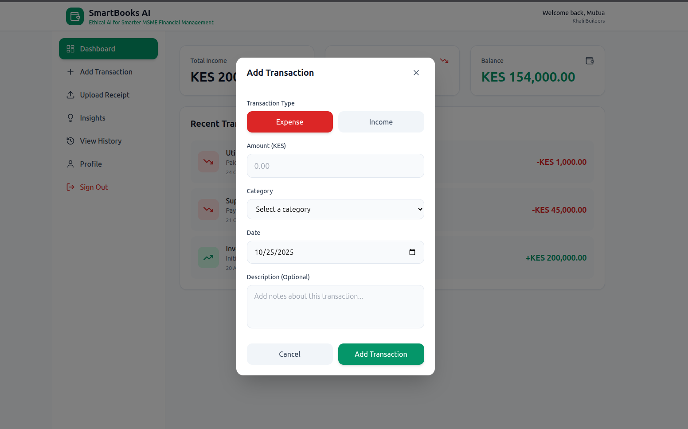
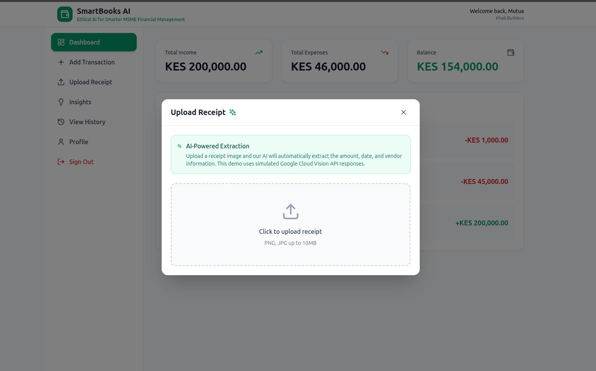
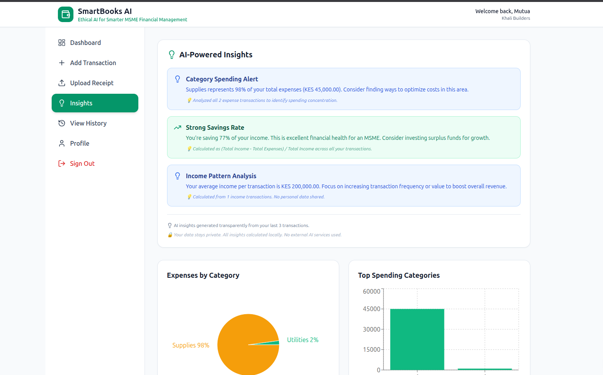
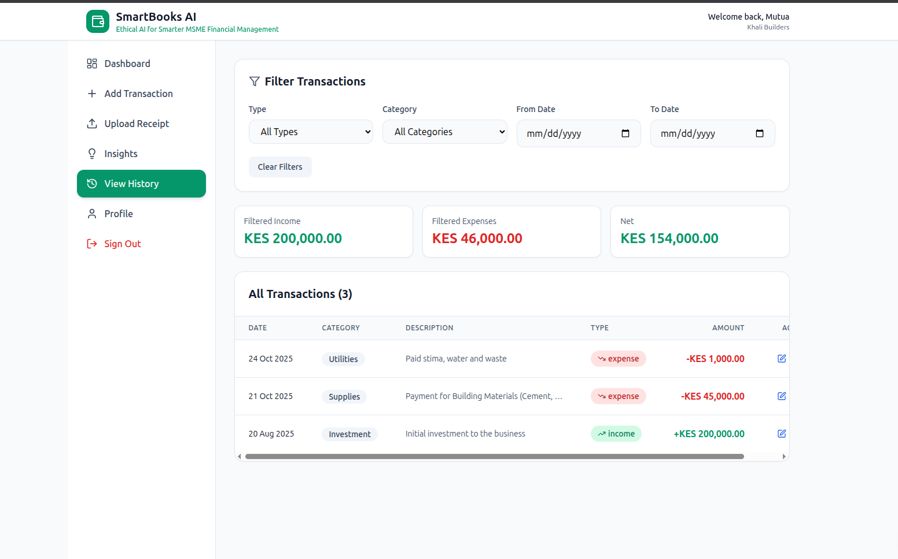

# Project Name: ``SmartBooks``

> **SmartBooks** is an intelligent bookkeeping and financial management platform.
- It is designed to help **Micro, Small, and Medium Enterprises (MSMEs)** manage their income, expenses, and receipts more efficiently powered by **Supabase** and **Google AI tools**.

- Built for the **CBK AI Hackathon 2025**, SmartBooks will empowers business owners to automate record keeping, gain actionable financial insights, and make better data-driven decisions.

##  Problem Statement
> Many MSMEs still use manual bookkeeping or spreadsheets to manage their finances.  
- This often leads to:
  - Lost or inaccurate financial records  
  - Difficulty tracking income, expenses, or receipts  
  - Poor visibility into spending patterns  
  - Lack of financial insights for decision-making  

## Our Solution
> **SmartBooks** uses cloud-based automation and AI to simplify business finance management.  
- The system allows MSMEs to:
  - Record daily income and expenses quickly  
  - Upload receipts — AI extracts key details like **amount**, **date**, and **vendor name**  
  - View financial summaries, trends, and visual insights  
  - Access and review historical financial records  
  - Get **AI-powered recommendations** for better financial planning  

## Key Features
- **Authentication** – Secure user login and registration (Supabase Auth)  
- **Dashboard** – Real-time income, expenses, and balance overview  
- **Add Transaction** – Easily log income or expense details  
- **Upload Receipt (AI)** – Upload a receipt; **Google Cloud Vision API** extracts text automatically  
- **AI Insights** – Uses **Google AI tools** to provide financial summaries, trends, and tips  
- **Visual Analytics** – Interactive graphs and charts (via Recharts)  
- **History Page** – Review, filter, edit, or delete previous transactions  
- **Profile Management** – Update business details and manage privacy preferences  
- **Ethical AI** – Transparent, privacy-respecting AI recommendations  

## Tech Stack
| Layer | Technology Used |
|-------|------------------|
| **Frontend** | React + Vite |
| **Backend** | Supabase Edge Functions |
| **Database** | Supabase (PostgreSQL) |
| **Authentication** | Supabase Auth |
| **AI Services** | Google Cloud Vision API, Google AI Studio (Gemini models) |
| **Charts & Visuals** | Recharts |
| **UI Framework** | Tailwind CSS |
| **Hosting** | Vercel / Netlify |

## Core Modules

###### 1. Authentication
- Secure registration and login system built with **Supabase Auth** — each user has their own workspace.

###### 2. Dashboard
> Displays financial summaries with cards for:
- Total Income  
- Total Expenses  
- Current Balance  
- Visual analytics with bar, pie, and line charts

###### 3. Add Transaction
- Simple form to add new transactions (income or expense).  
- Each transaction is stored in the Supabase database and displayed instantly.

###### 4. Upload Receipt (AI)
- Upload a receipt (image or PDF) —  
  - → The **Google Cloud Vision API** extracts key details  
  - → Data auto-fills into the transaction form for review and saving

###### 5. AI Insights
> Uses **Google AI models** to analyze spending trends and generate:
- Monthly summaries  
- Smart tips (e.g., reduce recurring costs)  
- Income–expense comparisons  

###### 6. View History
All transactions are listed with filters by **date**, **category**, and **type**, plus options to **edit** or **delete**.

